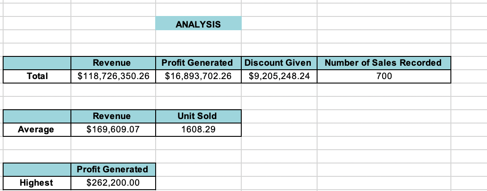

# Sales-Data-Report
## Introduction
This is my first excel project which enables me to use Excels basic functions.
In this project I made use of the Sum, Average, Count, and IF function. 

I was provided with raw data and from this data, I was able to calculate the total revenue, profit generated, Average revenue, Unit sold per every order, Total discount given, Total number of sales recorded and the highest profit generated.

